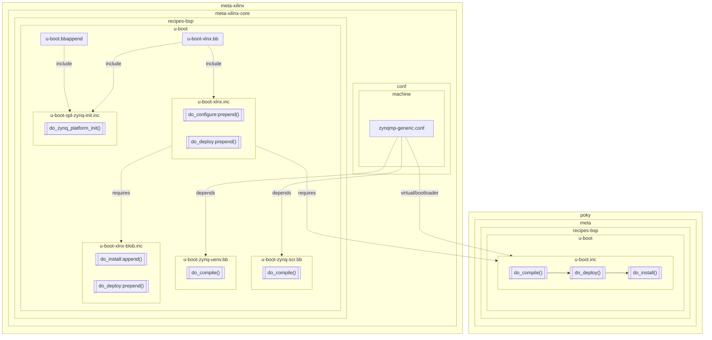

# meta-xilinx/meta-xilinx-core/recipes-bsp/u-boot



```
flowchart TD
subgraph poky
	subgraph meta
		subgraph meta-recipes-bsp[recipes-bsp]
			subgraph meta-u-boot[u-boot]
				subgraph u-boot.inc
                    do_compile1[["do_compile()"]]-->
                    do_deploy1[["do_deploy()"]]-->
                    do_install1[["do_install()"]]
                end
			end
		end
	end
end
u-boot-xlnx.inc-..->|requires|u-boot.inc
subgraph meta-xilinx
    subgraph meta-xilinx-core
        subgraph meta-xilinx-tools-recipes-bsp[recipes-bsp]
            subgraph meta-xilinx-tools-u-boot[u-boot]
                subgraph u-boot-zynq-scr.bb
                    do_compile_scr[["do_compile()"]]
                end
                subgraph u-boot-zynq-uenv.bb
                    do_compile_uenv[["do_compile()"]]
                end
                subgraph u-boot-xlnx-blob.inc[u-boot-xlnx-blob.inc]
                    do_install2[["do_install:append()"]]
                    do_deploy2[["do_deploy:prepend()"]]
                end
                subgraph u-boot-xlnx.inc
                    do_configure3[["do_configure:prepend()"]]
                    do_deploy3[["do_deploy:prepend()"]]
                end
                subgraph u-boot-xlnx.bb
                end
                subgraph u-boot-spl-zynq-init.inc
                    do_zynq_platform_init[["do_zynq_platform_init()"]]
                end
                subgraph u-boot.bbappend
                end
            end
        end
        subgraph conf
            subgraph machine
                zynqmp-generic.conf
            end
        end
    end
end

u-boot.bbappend-..->|include|u-boot-spl-zynq-init.inc
zynqmp-generic.conf-..->|depends|u-boot-zynq-scr.bb
zynqmp-generic.conf-..->|depends|u-boot-zynq-uenv.bb
zynqmp-generic.conf-..->|virtual/bootloader|u-boot.inc
u-boot-xlnx.inc-..->|requires|u-boot-xlnx-blob.inc
u-boot-xlnx.bb-..->|include|u-boot-xlnx.inc
u-boot-xlnx.bb-..->|include|u-boot-spl-zynq-init.inc
```
